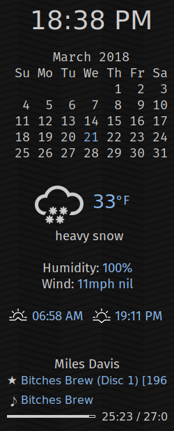

# Conky configuration wth calendar and current weather #

## Prerequesites ##

Requires lua, lua-socket, lua-sec and lua-json

Fonts:
* Symbola (for unicode symbols)
* Fira Sans, Fira Sans mono

## Install ##

Copy the files to `~/.config/conky`

## Configure ##

Edit `weather.lua` and set the city id, api key and cf variables

The calendar must be displayed in a monospace font for proper alignment

In order for "now playing" information to show up, you need to use mpd or edit
the config for another supported music player like moc.

## Run ##

conky -c ~/.config/conky.config

## Screenshot ##

